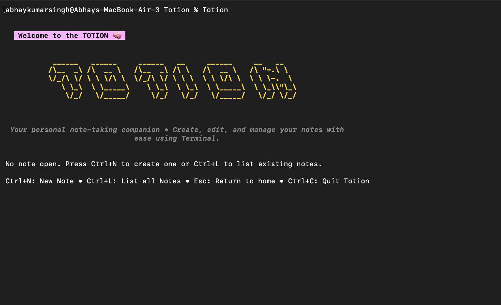

# Totion 🧠

[](https://go.dev/)  [](LICENSE) [](http://makeapullrequest.com)

<div align="center">

**A beautiful terminal-based note-taking application built with Go and [Bubble Tea](https://github.com/charmbracelet/bubbletea).**
<br>
Totion provides an intuitive, keyboard-driven interface for creating, editing, and managing your notes directly from the terminal.



</div>

---

## ✨ Features

| Feature | Description |
| :--- | :--- |
| 📝 **Create & Edit** | Write and edit markdown notes effortlessly |
| 📋 **List View** | Browse all your notes with a beautiful terminal UI |
| 🗑️ **Management** | Easily delete notes you no longer need |
| 💾 **Auto-save** | Notes are automatically saved when you close them |
| 🎨 **Beautiful UI** | Modern terminal interface with styled components |
| 🔍 **Search** | Filter through your notes using built-in search |
| 🤖 **AI-Powered** | Intelligent text completion using Google's Gemini API |

## 🚀 Installation

### Prerequisites

- **Go 1.25.3** or later
- A terminal with support for **ANSI colors**

### Building from Source

1. **Clone the repository:**
   ```bash
   git clone https://github.com/AbhaySingh002/Totion.git
   cd Totion
   ```

2. **Configure the API Key:**
   - Open `internal/app/data.go`
   - Replace `GEMINI-API-KEY` with your actual Google Gemini API key
   - *Get an API key from [Google AI Studio](https://aistudio.google.com/)*

3. **Build the application:**
   ```bash
   make build
   ```
   *Or manually:* `go build -o Totion ./cmd/totion`

4. **Run the application:**
   ```bash
   make run
   ```
   *Or directly:* `./Totion`

### Building for Windows

```bash
make windows
```
*Creates `Totion.exe` in the current directory.*

## 📖 Usage

When you first run Totion, it will create a `.totion` directory in your home directory where all your notes will be stored as `.md` files.

### ⌨️ Keyboard Shortcuts

#### General Navigation
| Key | Action |
| :--- | :--- |
| `Ctrl+N` | Create a new note |
| `Ctrl+L` | List all notes |
| `Esc` | Return to home screen / Cancel |
| `Ctrl+C` | Quit Totion |

#### Editing Notes
| Key | Action |
| :--- | :--- |
| `Ctrl+S` | Save current note |
| `Esc` | Save and close note |
| `Ctrl+N` | Save and create new note |
| `Ctrl+L` | Save and open notes list |

#### Notes List
| Key | Action |
| :--- | :--- |
| `↑/↓` | Navigate through notes |
| `Enter` | Open selected note |
| `Del/Backspace` | Delete selected note |
| `/` | Filter/search notes |

#### 🤖 AI Assistance
| Key | Action |
| :--- | :--- |
| `Ctrl+T` | Toggle Autocomplete mode |
| `Ctrl+G` | Get next suggestion (when Autocomplete is on) |
| `Tab` | Accept current suggestion |

## 📂 Project Structure

```
Totion/
├── cmd/
│   └── totion/
│       └── main.go          # Application entry point
├── internal/
│   ├── app/
│   │   ├── app.go           # Main application logic and Bubble Tea model
│   │   └── data.go          # Constants and help text
│   ├── file/
│   │   └── file.go          # File operations and note listing
│   ├── styles/
│   │   └── styles.go        # UI styling and colors
│   └── tui/
│       └── components.go    # TUI components (text input, textarea)
├── go.mod                   # Go module dependencies
├── makefile                 # Build commands
└── README.md                # This file
```

## 📦 Notes Storage

All notes are stored in `~/.totion/` directory as Markdown (`.md`) files. You can:
- Access your notes directly from the file system
- Edit them with any text editor
- Sync the directory with cloud storage services
- Backup the entire directory

## 🛠️ Dependencies

- [Bubble Tea](https://github.com/charmbracelet/bubbletea) - Terminal UI framework
- [Bubbles](https://github.com/charmbracelet/bubbles) - Bubble Tea components
- [Lip Gloss](https://github.com/charmbracelet/lipgloss) - Styling library

## 📄 License

See [LICENSE](LICENSE) file for details.

---

<div align="center">

**Made with ❤️ using Go and Bubble Tea**

</div>
